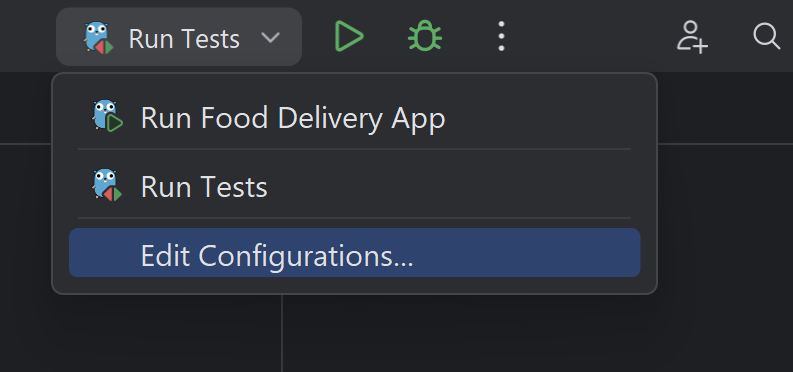

# Go Food Delivery


[](https://app.codacy.com?utm_source=gh&utm_medium=referral&utm_content=&utm_campaign=Badge_grade)


### Prerequisites

Before starting up this project, make sure you have the necessary dependencies installed in your machine.

###  Installation

- [x] [Go](https://go.dev/) - Go is an open source programming language that makes it simple to build secure, scalable systems.

- [x] [Docker](https://www.docker.com/) - Docker helps developers bring their ideas to life by conquering the complexity of app development.

- [x] [PostgreSQL](https://www.postgresql.org/) - The World's Most Advanced Open Source Relational Database

- [x] [NATS](https://nats.io/) - NATS is an open-source messaging system. The NATS server is written in the Go programming language


#### Running Postgres Database

```bash
docker run --name food-delivery -p 5432:5432 -e POSTGRES_PASSWORD=****** -d postgres
```

#### Running NATS

```bash
docker network create nats
docker run --name nats -d --network nats --rm -p 4222:4222 -p 8222:8222 nats --http_port 8222 --cluster_name NATS --cluster nats://0.0.0.0:6222
```


### Environment Variables

Be sure to place the `.env` file in the project root and update the information according to your settings. Refer to the example below.

```
APP_ENV=dev
DB_HOST=localhost
DB_USERNAME=postgres
DB_PASSWORD=*************
DB_NAME=food_delivery
DB_PORT=5432
STORAGE_TYPE=local
STORAGE_DIRECTORY=uploads
LOCAL_STORAGE_PATH=C:\Users\win10\GolandProjects\Go_Food_Delivery\uploads
UNSPLASH_API_KEY=*******************
JWT_SECRET_KEY=********************
PASSWORD_SALT=********************
```

Once you’re ready, clone this repository in [GoLand](https://www.jetbrains.com/go/) to easily start using the application.


